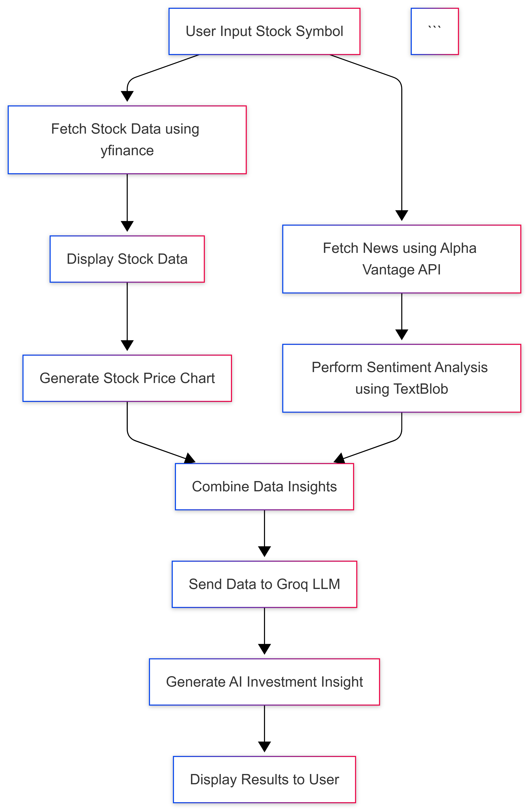
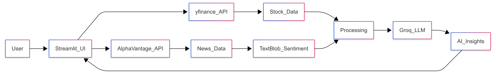

# StockSense AI 📈

StockSense AI is a simple AI-powered stock analysis system that combines financial data, news sentiment analysis, and large language models to generate investment insights.

## Features

* 📊 Stock price analysis using **yfinance**
* 📰 Financial news sentiment analysis
* 🤖 AI-generated investment insights using **Groq LLM**
* 📈 Interactive stock charts with **Plotly**

## Technologies Used

* Python
* Streamlit
* yfinance
* Alpha Vantage API
* TextBlob
* Plotly
* Groq LLM

## Workflow



## System Architecture



## Installation

```bash
pip install streamlit yfinance pandas plotly textblob requests langchain-groq
```

## Run the Application

```bash
streamlit run app.py
```

---

⚠️ This project is for **educational purposes only** and should not be considered financial advice.
